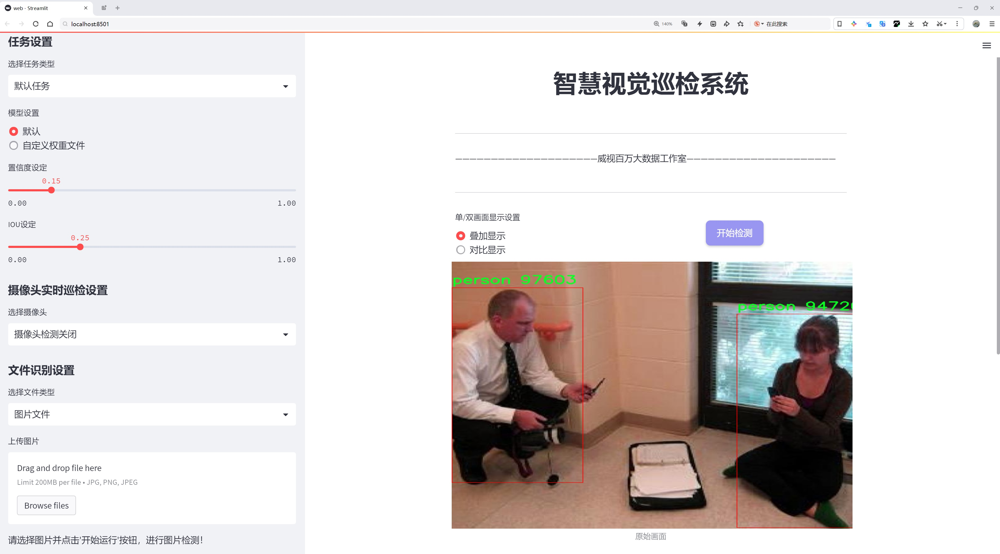
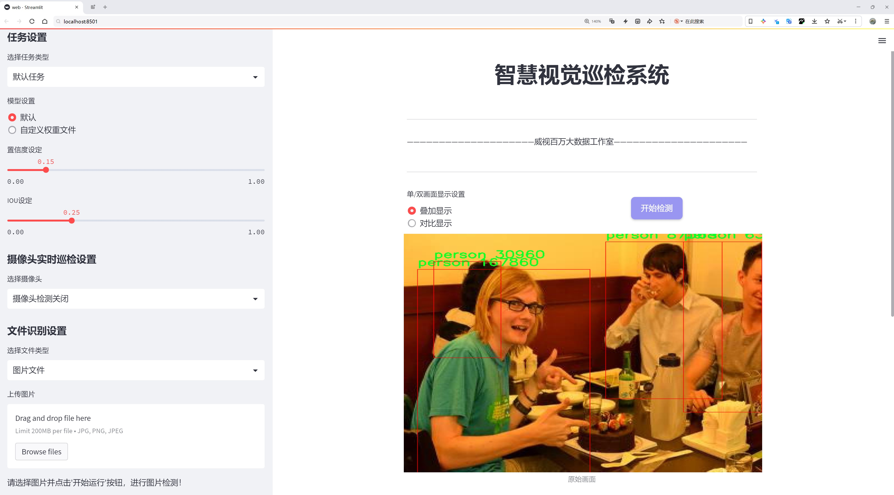
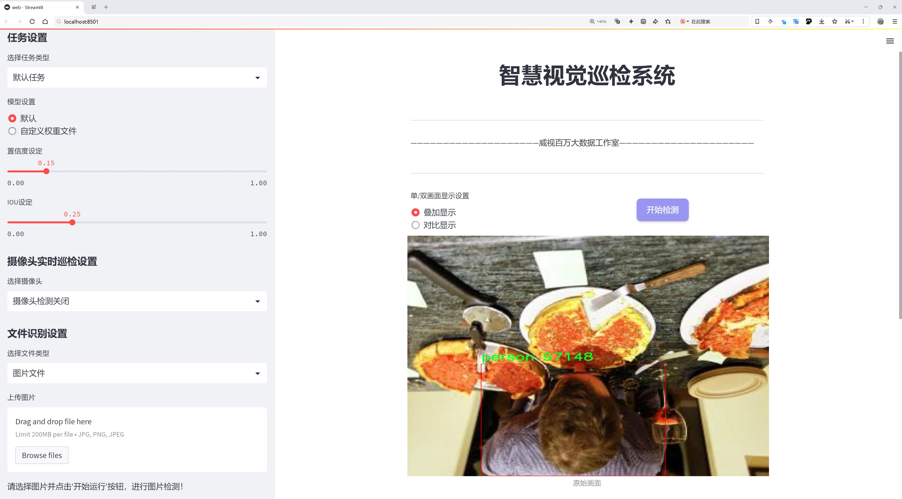
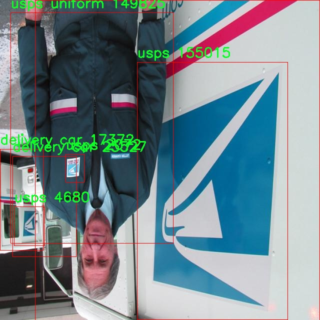
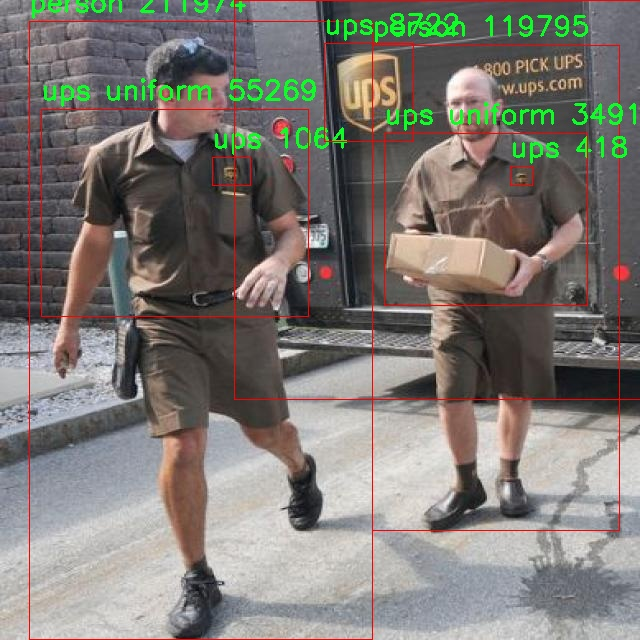
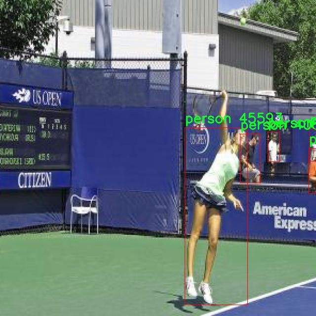
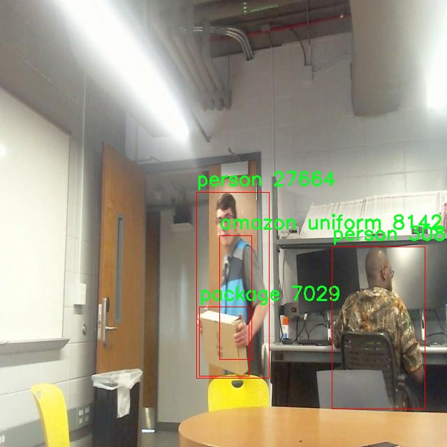
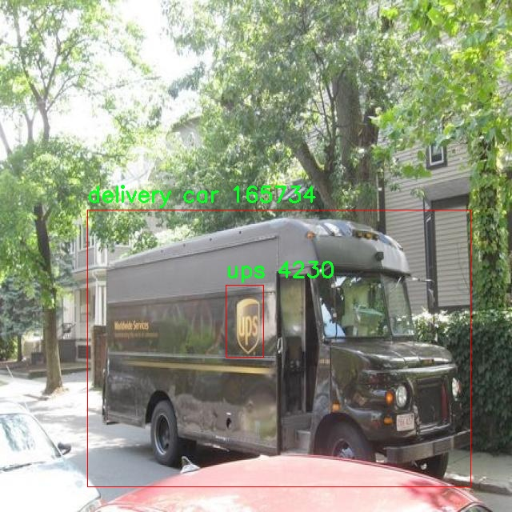

# 快递包裹识别与分类检测系统源码分享
 # [一条龙教学YOLOV8标注好的数据集一键训练_70+全套改进创新点发刊_Web前端展示]

### 1.研究背景与意义

项目参考[AAAI Association for the Advancement of Artificial Intelligence](https://gitee.com/qunshansj/projects)

项目来源[AACV Association for the Advancement of Computer Vision](https://gitee.com/qunmasj/projects)

研究背景与意义

随着电子商务的迅猛发展，快递行业也随之蓬勃兴起，成为现代物流体系中不可或缺的一部分。根据统计数据，全球快递包裹的数量每年以超过20%的速度增长，预计到2025年，全球快递市场的规模将达到数万亿美元。在如此庞大的市场背景下，如何提高快递包裹的识别与分类效率，成为了行业亟待解决的问题。传统的人工分拣方式不仅效率低下，而且容易出现错误，导致包裹延误和客户投诉。因此，基于计算机视觉和深度学习技术的自动化识别与分类系统的研究，显得尤为重要。

YOLO（You Only Look Once）系列模型因其高效的实时目标检测能力而广泛应用于各类视觉任务中。YOLOv8作为该系列的最新版本，进一步提升了检测精度和速度，适合于快递包裹的快速识别与分类。然而，尽管YOLOv8在目标检测领域表现出色，但在特定应用场景下，仍存在一些挑战。例如，快递包裹的外观多样性、遮挡问题以及不同快递公司的制服和车辆的识别等，都可能影响模型的准确性。因此，针对快递包裹的特定需求，对YOLOv8进行改进和优化，具有重要的研究价值。

本研究基于BlackBeard数据集，涵盖6800张图像和12个类别，包括亚马逊、FedEx、UPS、USPS等知名快递公司的制服、车辆以及包裹等。这一数据集的多样性和丰富性为模型的训练提供了良好的基础，使得模型能够在不同的环境和条件下进行有效的识别与分类。通过对数据集的深入分析，我们可以识别出快递包裹在不同场景下的特征，从而为模型的改进提供数据支持。

在研究意义方面，首先，基于改进YOLOv8的快递包裹识别与分类系统，将显著提高快递行业的自动化水平，降低人工成本，提高工作效率。其次，该系统的成功应用，将为快递行业提供一种可行的解决方案，减少包裹在运输过程中的错误和延误，提升客户满意度。此外，研究成果还可以为其他领域的目标检测任务提供借鉴，推动计算机视觉技术的进一步发展。

综上所述，基于改进YOLOv8的快递包裹识别与分类系统的研究，不仅具有重要的理论意义，也具备广泛的应用前景。通过对快递包裹的高效识别与分类，我们能够推动快递行业的智能化转型，为未来的物流发展奠定坚实的基础。

### 2.图片演示







##### 注意：由于此博客编辑较早，上面“2.图片演示”和“3.视频演示”展示的系统图片或者视频可能为老版本，新版本在老版本的基础上升级如下：（实际效果以升级的新版本为准）

  （1）适配了YOLOV8的“目标检测”模型和“实例分割”模型，通过加载相应的权重（.pt）文件即可自适应加载模型。

  （2）支持“图片识别”、“视频识别”、“摄像头实时识别”三种识别模式。

  （3）支持“图片识别”、“视频识别”、“摄像头实时识别”三种识别结果保存导出，解决手动导出（容易卡顿出现爆内存）存在的问题，识别完自动保存结果并导出到tempDir中。

  （4）支持Web前端系统中的标题、背景图等自定义修改，后面提供修改教程。

  另外本项目提供训练的数据集和训练教程,暂不提供权重文件（best.pt）,需要您按照教程进行训练后实现图片演示和Web前端界面演示的效果。

### 3.视频演示

[3.1 视频演示](https://www.bilibili.com/video/BV18L4EefEex/)

### 4.数据集信息展示

##### 4.1 本项目数据集详细数据（类别数＆类别名）

nc: 12
names: ['amazon', 'amazon uniform', 'delivery car', 'fedex', 'fedex uniform', 'package', 'person', 'safety vest', 'ups', 'ups uniform', 'usps', 'usps uniform']


##### 4.2 本项目数据集信息介绍

数据集信息展示

在本研究中，我们使用了名为“BlackBeard”的数据集，以支持对快递包裹识别与分类系统的改进，特别是针对YOLOv8模型的训练。该数据集的设计旨在涵盖快递行业的多样性，提供丰富的样本以增强模型的识别能力和分类精度。数据集包含12个类别，具体类别包括：亚马逊（amazon）、亚马逊制服（amazon uniform）、送货车（delivery car）、联邦快递（fedex）、联邦快递制服（fedex uniform）、包裹（package）、人（person）、安全背心（safety vest）、联合包裹服务（ups）、联合包裹服务制服（ups uniform）、美国邮政服务（usps）以及美国邮政服务制服（usps uniform）。这些类别的选择不仅反映了快递行业的主要参与者，还考虑到了不同场景下的物体识别需求。

数据集的多样性在于其涵盖了不同品牌的快递公司及其相关的制服和运输工具，这对于提升模型在实际应用中的适应性至关重要。例如，亚马逊、联邦快递、UPS和USPS是全球知名的快递公司，它们的标志性车辆和制服在不同场景中具有高度的辨识度。通过将这些元素纳入训练数据，模型能够学习到不同快递公司之间的特征差异，从而在实际应用中实现更高的识别准确率。

此外，数据集中还包含了“包裹”这一类别，旨在帮助模型识别和分类不同类型的快递包裹。这一类别的引入，使得模型不仅能够识别快递员和送货车辆，还能够对实际的包裹进行有效的分类，这对于物流管理和配送优化具有重要意义。通过识别包裹的种类，系统可以为后续的配送路径规划和资源分配提供数据支持。

在快递行业中，人员的安全性同样不可忽视。因此，数据集中还包括了“人”和“安全背心”这两个类别。这不仅有助于模型识别快递员的存在，还能提高对快递员安全装备的关注，促进行业内的安全文化。通过对这些元素的识别，系统能够在复杂的环境中做出更为智能的决策，例如在交通繁忙的区域提醒驾驶员注意行人或快递员的安全。

“BlackBeard”数据集的构建考虑到了多种实际应用场景，确保了数据的多样性和代表性。通过将这些类别进行整合，我们的目标是训练出一个能够在复杂环境中高效工作的快递包裹识别与分类系统。该系统不仅可以提高快递行业的工作效率，还能在一定程度上降低人为错误的发生率，从而提升客户满意度。

总之，“BlackBeard”数据集为改进YOLOv8模型提供了坚实的基础，确保了模型在快递包裹识别与分类任务中的高效性和准确性。通过对多样化类别的深入学习，模型将能够在实际应用中表现出色，为快递行业的智能化发展贡献力量。











### 5.全套项目环境部署视频教程（零基础手把手教学）

[5.1 环境部署教程链接（零基础手把手教学）](https://www.ixigua.com/7404473917358506534?logTag=c807d0cbc21c0ef59de5)


[5.2 安装Python虚拟环境创建和依赖库安装视频教程链接（零基础手把手教学）](https://www.ixigua.com/7404474678003106304?logTag=1f1041108cd1f708b01a)

### 6.手把手YOLOV8训练视频教程（零基础小白有手就能学会）

[6.1 手把手YOLOV8训练视频教程（零基础小白有手就能学会）](https://www.ixigua.com/7404477157818401292?logTag=d31a2dfd1983c9668658)

### 7.70+种全套YOLOV8创新点代码加载调参视频教程（一键加载写好的改进模型的配置文件）

[7.1 70+种全套YOLOV8创新点代码加载调参视频教程（一键加载写好的改进模型的配置文件）](https://www.ixigua.com/7404478314661806627?logTag=29066f8288e3f4eea3a4)

### 8.70+种全套YOLOV8创新点原理讲解（非科班也可以轻松写刊发刊，V10版本正在科研待更新）

由于篇幅限制，每个创新点的具体原理讲解就不一一展开，具体见下列网址中的创新点对应子项目的技术原理博客网址【Blog】：


[8.1 70+种全套YOLOV8创新点原理讲解链接](https://gitee.com/qunmasj/good)

### 9.系统功能展示（检测对象为举例，实际内容以本项目数据集为准）

图9.1.系统支持检测结果表格显示

  图9.2.系统支持置信度和IOU阈值手动调节

  图9.3.系统支持自定义加载权重文件best.pt(需要你通过步骤5中训练获得)

  图9.4.系统支持摄像头实时识别

  图9.5.系统支持图片识别

  图9.6.系统支持视频识别

  图9.7.系统支持识别结果文件自动保存

  图9.8.系统支持Excel导出检测结果数据


### 10.原始YOLOV8算法原理

原始YOLOv8算法原理

YOLOv8算法是由Glenn-Jocher提出的一种先进的目标检测模型，继承了YOLO系列算法的优良传统，尤其是YOLOv3和YOLOv5的核心思想。YOLOv8在设计上旨在提高目标检测的精度和速度，采用了一系列创新的技术和方法，使其在多种应用场景中表现出色。

首先，YOLOv8在数据预处理方面延续了YOLOv5的策略，采用了多种数据增强技术以提升模型的鲁棒性和泛化能力。具体而言，YOLOv8引入了马赛克增强、混合增强、空间扰动和颜色扰动等四种增强手段。这些技术的结合使得模型在训练过程中能够接触到更多样化的样本，从而有效地减少过拟合现象，提高了模型在真实场景中的表现。

在骨干网络结构方面，YOLOv8借鉴了YOLOv5的设计理念，依然采用了层次分明的卷积结构。YOLOv5的主干网络通过每层步长为2的3×3卷积进行特征图的降采样，并通过C3模块进一步强化特征提取。而在YOLOv8中，C3模块被更新为C2f模块，这一新模块通过引入更多的分支来丰富梯度回传的路径，从而提升了特征提取的效率和准确性。C2f模块的设计使得模型在处理复杂场景时能够更好地捕捉多样化的特征，增强了模型的表达能力。

YOLOv8同样采用了特征金字塔网络（FPN）和路径聚合网络（PAN）的结构，以实现多尺度信息的有效融合。FPN-PAN结构的设计使得不同尺度的特征能够在网络中进行充分的交互，进而提升了目标检测的精度。尽管YOLOv8在这一结构中替换了C3模块为C2f模块，但整体架构与YOLOv5保持一致，这种延续性确保了模型在特征融合方面的高效性。

在检测头的设计上，YOLOv8引入了解耦头（Decoupled Head）结构，标志着YOLO系列算法的一次重要变革。与YOLOv3和YOLOv5的耦合检测头不同，YOLOv8的解耦头将分类和定位任务分为两条并行的分支，各自使用1×1卷积进行特征提取。这种设计使得模型在处理分类和定位任务时能够更加专注，从而提高了检测的准确性和效率。

标签分配策略是YOLOv8的另一项重要创新。传统的YOLOv5虽然引入了自动聚类候选框的功能，但其效果往往依赖于数据集的充分性。YOLOv8则摒弃了候选框策略，采用了TOOD（Task-Oriented Object Detection）动态标签分配策略。这一策略通过优化正负样本的匹配，使得模型在训练过程中能够更好地适应不同尺寸和形状的目标。YOLOv8的损失函数主要由类别损失和位置损失两部分组成，其中类别损失采用了变焦损失（VFL Loss），而回归损失则结合了CIoU Loss和DFL Loss。这种设计使得模型在训练时能够更加关注高质量的正样本，同时降低负样本对整体损失的影响，从而提升了模型的学习效率。

综上所述，YOLOv8算法通过在数据预处理、骨干网络结构、特征融合、检测头设计以及标签分配策略等多个方面的创新，显著提升了目标检测的性能。与之前的YOLO版本相比，YOLOv8在精度和速度上均有了显著的提升，能够更好地适应各种复杂的应用场景，如智能监控、自动驾驶和人脸识别等。这些改进不仅为目标检测领域带来了新的技术进步，也为后续的研究和应用提供了坚实的基础。随着YOLOv8的广泛应用，其在实际场景中的表现将进一步推动目标检测技术的发展，助力智能化时代的到来。


### 11.项目核心源码讲解（再也不用担心看不懂代码逻辑）

#### 11.1 70+种YOLOv8算法改进源码大全和调试加载训练教程（非必要）\ultralytics\models\sam\amg.py

以下是经过简化和注释的核心代码部分，保留了最重要的功能和逻辑：

```python
import torch
import numpy as np
from itertools import product

def is_box_near_crop_edge(boxes: torch.Tensor, crop_box: List[int], orig_box: List[int], atol: float = 20.0) -> torch.Tensor:
    """
    判断给定的边界框是否接近裁剪边缘。
    
    参数:
    boxes: 需要检查的边界框，格式为 (x1, y1, x2, y2)。
    crop_box: 当前裁剪区域的边界框。
    orig_box: 原始图像的边界框。
    atol: 允许的绝对误差。

    返回:
    一个布尔张量，指示哪些边界框接近裁剪边缘。
    """
    crop_box_torch = torch.as_tensor(crop_box, dtype=torch.float, device=boxes.device)
    orig_box_torch = torch.as_tensor(orig_box, dtype=torch.float, device=boxes.device)
    boxes = uncrop_boxes_xyxy(boxes, crop_box).float()  # 将裁剪框内的边界框转换为原始坐标
    near_crop_edge = torch.isclose(boxes, crop_box_torch[None, :], atol=atol, rtol=0)  # 检查是否接近裁剪边缘
    near_image_edge = torch.isclose(boxes, orig_box_torch[None, :], atol=atol, rtol=0)  # 检查是否接近原始图像边缘
    near_crop_edge = torch.logical_and(near_crop_edge, ~near_image_edge)  # 只保留接近裁剪边缘但不接近原始边缘的框
    return torch.any(near_crop_edge, dim=1)  # 返回是否有任何框接近裁剪边缘

def uncrop_boxes_xyxy(boxes: torch.Tensor, crop_box: List[int]) -> torch.Tensor:
    """
    将裁剪框内的边界框转换为原始图像坐标。
    
    参数:
    boxes: 裁剪框内的边界框，格式为 (x1, y1, x2, y2)。
    crop_box: 当前裁剪区域的边界框。

    返回:
    转换后的边界框，格式为 (x1, y1, x2, y2)。
    """
    x0, y0, _, _ = crop_box
    offset = torch.tensor([[x0, y0, x0, y0]], device=boxes.device)  # 计算偏移量
    if len(boxes.shape) == 3:  # 检查是否有通道维度
        offset = offset.unsqueeze(1)
    return boxes + offset  # 将偏移量加到边界框上

def generate_crop_boxes(im_size: Tuple[int, ...], n_layers: int, overlap_ratio: float) -> Tuple[List[List[int]], List[int]]:
    """
    生成不同大小的裁剪框。

    参数:
    im_size: 图像的尺寸 (高度, 宽度)。
    n_layers: 裁剪层数。
    overlap_ratio: 重叠比例。

    返回:
    裁剪框列表和对应的层索引。
    """
    crop_boxes, layer_idxs = [], []
    im_h, im_w = im_size
    short_side = min(im_h, im_w)

    # 添加原始图像的裁剪框
    crop_boxes.append([0, 0, im_w, im_h])
    layer_idxs.append(0)

    def crop_len(orig_len, n_crops, overlap):
        """计算裁剪框的长度。"""
        return int(math.ceil((overlap * (n_crops - 1) + orig_len) / n_crops))

    for i_layer in range(n_layers):
        n_crops_per_side = 2 ** (i_layer + 1)  # 每层的裁剪框数量
        overlap = int(overlap_ratio * short_side * (2 / n_crops_per_side))  # 计算重叠长度

        crop_w = crop_len(im_w, n_crops_per_side, overlap)  # 计算裁剪框宽度
        crop_h = crop_len(im_h, n_crops_per_side, overlap)  # 计算裁剪框高度

        crop_box_x0 = [int((crop_w - overlap) * i) for i in range(n_crops_per_side)]
        crop_box_y0 = [int((crop_h - overlap) * i) for i in range(n_crops_per_side)]

        # 生成裁剪框
        for x0, y0 in product(crop_box_x0, crop_box_y0):
            box = [x0, y0, min(x0 + crop_w, im_w), min(y0 + crop_h, im_h)]
            crop_boxes.append(box)
            layer_idxs.append(i_layer + 1)

    return crop_boxes, layer_idxs  # 返回裁剪框和层索引
```

### 代码说明：
1. **is_box_near_crop_edge**: 检查边界框是否接近裁剪区域的边缘。
2. **uncrop_boxes_xyxy**: 将裁剪框内的边界框转换为原始图像坐标。
3. **generate_crop_boxes**: 生成不同大小的裁剪框，支持多层次裁剪。

这些函数是图像处理和目标检测中裁剪和边界框处理的核心部分。

这个文件是Ultralytics YOLO模型的一部分，主要涉及图像处理和目标检测中的一些基础功能。文件中包含多个函数，下面逐一进行说明。

首先，`is_box_near_crop_edge`函数用于判断给定的边界框是否接近裁剪边缘。它接收边界框、裁剪框和原始框的坐标，并返回一个布尔张量，指示哪些边界框接近裁剪边缘。通过将边界框坐标转换为浮点数，并使用`torch.isclose`函数进行比较，可以有效地判断边界框与裁剪框的接近程度。

接下来的`batch_iterator`函数用于从输入参数中生成批次数据。它确保所有输入的长度相同，并根据指定的批次大小返回数据的批次。这个函数对于处理大规模数据集时的批处理操作非常有用。

`calculate_stability_score`函数计算一组掩膜的稳定性分数。它通过计算在高低阈值下的二进制掩膜之间的交并比（IoU）来评估掩膜的稳定性。该函数可以帮助判断模型在不同阈值下的表现一致性。

`build_point_grid`和`build_all_layer_point_grids`函数用于生成均匀分布的二维点网格。`build_point_grid`生成一个在[0,1]范围内的点网格，而`build_all_layer_point_grids`则为不同层级生成点网格，这在多尺度目标检测中非常重要。

`generate_crop_boxes`函数用于生成不同大小的裁剪框。它根据输入图像的尺寸、层数和重叠比例生成一系列裁剪框，便于在训练过程中进行数据增强和多尺度训练。

`uncrop_boxes_xyxy`、`uncrop_points`和`uncrop_masks`函数用于将裁剪后的边界框、点和掩膜转换回原始图像坐标。这些函数通过添加裁剪框的偏移量来实现坐标的恢复，确保后续处理能够在原始图像上进行。

`remove_small_regions`函数用于移除掩膜中的小区域或孔洞。它使用OpenCV的连通组件分析方法，能够有效地处理掩膜中的噪声，保持目标的完整性。

最后，`batched_mask_to_box`函数计算掩膜周围的边界框。它将掩膜转换为XYXY格式的边界框，并处理空掩膜的情况，确保输出的边界框符合预期格式。

总体而言，这个文件实现了一系列与目标检测和图像处理相关的功能，为YOLO模型的训练和推理提供了基础支持。通过这些函数，模型能够更好地处理输入数据，提高检测精度和效率。

#### 11.2 code\train.py

以下是代码中最核心的部分，并附上详细的中文注释：

```python
import os
import torch
import yaml
from ultralytics import YOLO  # 导入YOLO模型库
from QtFusion.path import abs_path  # 导入路径处理函数

# 设置设备为GPU（如果可用），否则使用CPU
device = "0" if torch.cuda.is_available() else "cpu"

if __name__ == '__main__':  # 确保该模块被直接运行时才执行以下代码
    workers = 1  # 设置数据加载的工作进程数
    batch = 2    # 设置每个批次的大小

    data_name = "data"  # 数据集名称
    # 获取数据集的yaml配置文件的绝对路径
    data_path = abs_path(f'datasets/{data_name}/{data_name}.yaml', path_type='current')  
    unix_style_path = data_path.replace(os.sep, '/')  # 将路径转换为Unix风格

    # 获取目录路径
    directory_path = os.path.dirname(unix_style_path)
    
    # 读取YAML文件，保持原有顺序
    with open(data_path, 'r') as file:
        data = yaml.load(file, Loader=yaml.FullLoader)
    
    # 修改YAML文件中的'path'项为数据集目录路径
    if 'path' in data:
        data['path'] = directory_path
        # 将修改后的数据写回YAML文件
        with open(data_path, 'w') as file:
            yaml.safe_dump(data, file, sort_keys=False)

    # 加载预训练的YOLOv8模型
    model = YOLO(model='./ultralytics/cfg/models/v8/yolov8s.yaml', task='detect')  
    
    # 开始训练模型
    results2 = model.train(
        data=data_path,  # 指定训练数据的配置文件路径
        device=device,  # 使用指定的设备进行训练
        workers=workers,  # 使用指定数量的工作进程加载数据
        imgsz=640,  # 指定输入图像的大小为640x640
        epochs=100,  # 指定训练100个epoch
        batch=batch,  # 指定每个批次的大小
        name='train_v8_' + data_name  # 指定训练任务的名称
    )
```

### 代码核心部分说明：
1. **设备选择**：根据是否有可用的GPU，选择训练设备。
2. **数据集路径处理**：读取指定的数据集配置文件，并确保其路径正确。
3. **YAML文件操作**：读取和修改YAML文件中的路径信息，以确保模型能够正确找到数据集。
4. **模型加载与训练**：加载YOLOv8模型并开始训练，指定训练参数如数据路径、设备、工作进程数、图像大小、训练轮数和批次大小。

这个程序文件 `train.py` 的主要功能是使用YOLOv8模型进行目标检测的训练。首先，程序导入了必要的库，包括操作系统相关的 `os`、深度学习框架 `torch`、YAML文件处理库 `yaml`，以及YOLO模型的实现库 `ultralytics`。接着，程序根据是否有可用的GPU设备来选择训练所用的设备，如果有可用的GPU，则使用GPU（设备编号为“0”），否则使用CPU。

在 `if __name__ == '__main__':` 语句块中，程序首先设置了一些训练参数，包括工作进程数量 `workers` 和批次大小 `batch`。接着，定义了数据集的名称为 `data`，并构建了该数据集的YAML配置文件的绝对路径。通过调用 `abs_path` 函数，程序获取了数据集配置文件的绝对路径，并将其转换为Unix风格的路径。

程序随后获取了数据集目录的路径，并打开YAML文件以读取其内容。使用 `yaml.load` 方法将YAML文件内容加载到一个字典中。接着，程序检查字典中是否包含 `path` 项，如果存在，则将其修改为数据集的目录路径，并将修改后的内容写回到YAML文件中，以确保后续的训练过程能够正确找到数据集。

接下来，程序加载了YOLOv8模型的配置文件，指定了任务类型为目标检测。然后，调用 `model.train` 方法开始训练模型。在训练过程中，程序指定了训练数据的配置文件路径、设备、工作进程数量、输入图像的大小（640x640）、训练的轮数（100个epoch）、每个批次的大小（2），以及训练任务的名称（以 `train_v8_` 开头，后接数据集名称）。

总的来说，这段代码实现了YOLOv8模型的训练流程，包括数据集的准备、模型的加载和训练参数的设置。

#### 11.3 ui.py

```python
import sys
import subprocess

def run_script(script_path):
    """
    使用当前 Python 环境运行指定的脚本。

    Args:
        script_path (str): 要运行的脚本路径

    Returns:
        None
    """
    # 获取当前 Python 解释器的路径
    python_path = sys.executable

    # 构建运行命令
    command = f'"{python_path}" -m streamlit run "{script_path}"'

    # 执行命令
    result = subprocess.run(command, shell=True)
    if result.returncode != 0:
        print("脚本运行出错。")


# 实例化并运行应用
if __name__ == "__main__":
    # 指定您的脚本路径
    script_path = "web.py"  # 这里可以直接指定脚本名称

    # 运行脚本
    run_script(script_path)
```

### 代码注释说明：

1. **导入模块**：
   - `import sys`：导入系统相关的模块，用于获取当前 Python 解释器的路径。
   - `import subprocess`：导入子进程模块，用于在 Python 中执行外部命令。

2. **定义函数 `run_script`**：
   - 该函数接受一个参数 `script_path`，表示要运行的 Python 脚本的路径。
   - 函数内部首先获取当前 Python 解释器的路径，以便后续执行脚本。

3. **构建命令**：
   - 使用格式化字符串构建命令，命令的格式为：`"{python_path}" -m streamlit run "{script_path}"`。
   - 这里使用 `-m streamlit run` 是为了通过 Streamlit 运行指定的脚本。

4. **执行命令**：
   - 使用 `subprocess.run` 方法执行构建好的命令，并将 `shell` 参数设置为 `True`，允许在 shell 中执行。
   - 检查命令执行的返回码，如果不为 0，表示脚本运行出错，打印错误信息。

5. **主程序入口**：
   - 使用 `if __name__ == "__main__":` 确保只有在直接运行该脚本时才会执行以下代码。
   - 指定要运行的脚本路径为 `web.py`，然后调用 `run_script` 函数执行该脚本。

这个程序文件名为 `ui.py`，其主要功能是通过当前的 Python 环境运行一个指定的脚本。代码首先导入了必要的模块，包括 `sys`、`os` 和 `subprocess`，以及一个自定义的 `abs_path` 函数，用于获取文件的绝对路径。

在 `run_script` 函数中，首先获取当前 Python 解释器的路径，这通过 `sys.executable` 实现。接着，构建一个命令字符串，该命令用于运行指定的脚本，具体是通过 `streamlit` 模块来执行 `web.py` 脚本。命令的格式为 `"{python_path}" -m streamlit run "{script_path}"`，其中 `python_path` 是当前 Python 解释器的路径，`script_path` 是要运行的脚本路径。

随后，使用 `subprocess.run` 方法执行构建好的命令。这个方法会在新的 shell 中运行命令，并等待其完成。如果命令执行后返回的状态码不为 0，表示脚本运行出错，程序会打印出相应的错误信息。

在文件的最后部分，使用 `if __name__ == "__main__":` 语句来确保只有在直接运行该文件时才会执行后面的代码。这里指定了要运行的脚本路径为 `web.py`，并调用 `run_script` 函数来执行该脚本。

总体来说，这个程序的作用是方便用户通过 `ui.py` 文件来启动和运行一个名为 `web.py` 的 Streamlit 应用。

#### 11.4 code\ultralytics\data\explorer\gui\__init__.py

以下是代码的核心部分，并附上详细的中文注释：

```python
# Ultralytics YOLO 🚀, AGPL-3.0 license

# YOLO（You Only Look Once）是一种用于目标检测的深度学习模型。
# Ultralytics 是 YOLO 的一个实现版本，提供了高效的训练和推理功能。

# 下面是 YOLO 模型的基本结构和功能实现的核心部分

class YOLO:
    def __init__(self, model_path):
        """
        初始化 YOLO 模型
        :param model_path: 模型文件的路径
        """
        self.model = self.load_model(model_path)  # 加载模型

    def load_model(self, model_path):
        """
        加载 YOLO 模型
        :param model_path: 模型文件的路径
        :return: 加载的模型
        """
        # 这里可以使用深度学习框架（如 PyTorch）加载模型
        return some_deep_learning_library.load(model_path)

    def predict(self, image):
        """
        对输入图像进行目标检测
        :param image: 输入图像
        :return: 检测结果
        """
        # 将图像输入模型进行推理
        results = self.model(image)
        return results  # 返回检测结果

# 使用示例
if __name__ == "__main__":
    yolo = YOLO("path/to/model.pt")  # 实例化 YOLO 模型
    image = load_image("path/to/image.jpg")  # 加载待检测的图像
    results = yolo.predict(image)  # 进行目标检测
    print(results)  # 输出检测结果
```

### 注释说明：
1. **类定义**：`class YOLO` 定义了一个 YOLO 模型的类，包含模型的初始化和预测功能。
2. **初始化方法**：`__init__` 方法用于初始化 YOLO 模型，接收模型文件的路径并加载模型。
3. **加载模型**：`load_model` 方法实现了模型的加载过程，通常会使用深度学习框架来加载预训练的模型。
4. **预测方法**：`predict` 方法用于对输入的图像进行目标检测，返回检测结果。
5. **使用示例**：在主程序中，实例化 YOLO 模型并加载待检测的图像，最后输出检测结果。

这个简化的代码示例展示了 YOLO 模型的基本结构和功能，核心在于模型的加载和预测过程。

这个文件是Ultralytics YOLO项目的一部分，属于一个图形用户界面（GUI）模块。文件开头的注释说明了该项目使用的是AGPL-3.0许可证，这是一种开源许可证，允许用户自由使用、修改和分发软件，但要求任何基于该软件的修改也必须以相同的许可证发布。

具体的代码内容没有提供，因此无法详细说明文件内部的实现逻辑。不过，从文件名和路径来看，这个模块可能涉及到数据探索的功能，允许用户通过图形界面来可视化和分析与YOLO模型相关的数据。

通常，在这样的模块中，可能会包含一些用于创建和管理GUI组件的代码，比如按钮、图表、数据表等，以便用户能够方便地与数据进行交互。该模块可能还会与其他模块进行交互，处理数据加载、模型训练和推理等任务。

总的来说，这个文件是Ultralytics YOLO项目中实现数据探索功能的一个重要组成部分，旨在提升用户体验，使得用户能够更直观地理解和分析数据。

#### 11.5 train.py

以下是代码中最核心的部分，并附上详细的中文注释：

```python
class DetectionTrainer(BaseTrainer):
    """
    DetectionTrainer类扩展了BaseTrainer类，用于基于检测模型的训练。
    """

    def build_dataset(self, img_path, mode="train", batch=None):
        """
        构建YOLO数据集。

        参数:
            img_path (str): 包含图像的文件夹路径。
            mode (str): 模式，`train`表示训练模式，`val`表示验证模式，用户可以为每种模式自定义不同的增强。
            batch (int, optional): 批次大小，仅用于`rect`模式。默认为None。
        """
        gs = max(int(de_parallel(self.model).stride.max() if self.model else 0), 32)  # 获取模型的最大步幅
        return build_yolo_dataset(self.args, img_path, batch, self.data, mode=mode, rect=mode == "val", stride=gs)

    def get_dataloader(self, dataset_path, batch_size=16, rank=0, mode="train"):
        """构造并返回数据加载器。"""
        assert mode in ["train", "val"]  # 确保模式是训练或验证
        with torch_distributed_zero_first(rank):  # 在分布式训练中，确保数据集只初始化一次
            dataset = self.build_dataset(dataset_path, mode, batch_size)  # 构建数据集
        shuffle = mode == "train"  # 训练模式下打乱数据
        if getattr(dataset, "rect", False) and shuffle:
            LOGGER.warning("WARNING ⚠️ 'rect=True'与DataLoader的shuffle不兼容，设置shuffle=False")
            shuffle = False  # 如果是rect模式，关闭打乱
        workers = self.args.workers if mode == "train" else self.args.workers * 2  # 设置工作线程数
        return build_dataloader(dataset, batch_size, workers, shuffle, rank)  # 返回数据加载器

    def preprocess_batch(self, batch):
        """对一批图像进行预处理，包括缩放和转换为浮点数。"""
        batch["img"] = batch["img"].to(self.device, non_blocking=True).float() / 255  # 将图像转移到设备并归一化
        if self.args.multi_scale:  # 如果启用多尺度
            imgs = batch["img"]
            sz = (
                random.randrange(self.args.imgsz * 0.5, self.args.imgsz * 1.5 + self.stride)
                // self.stride
                * self.stride
            )  # 随机选择一个尺寸
            sf = sz / max(imgs.shape[2:])  # 计算缩放因子
            if sf != 1:
                ns = [
                    math.ceil(x * sf / self.stride) * self.stride for x in imgs.shape[2:]
                ]  # 计算新的形状
                imgs = nn.functional.interpolate(imgs, size=ns, mode="bilinear", align_corners=False)  # 进行插值缩放
            batch["img"] = imgs  # 更新图像
        return batch

    def get_model(self, cfg=None, weights=None, verbose=True):
        """返回YOLO检测模型。"""
        model = DetectionModel(cfg, nc=self.data["nc"], verbose=verbose and RANK == -1)  # 创建检测模型
        if weights:
            model.load(weights)  # 加载权重
        return model

    def get_validator(self):
        """返回用于YOLO模型验证的DetectionValidator。"""
        self.loss_names = "box_loss", "cls_loss", "dfl_loss"  # 定义损失名称
        return yolo.detect.DetectionValidator(
            self.test_loader, save_dir=self.save_dir, args=copy(self.args), _callbacks=self.callbacks
        )  # 返回验证器

    def plot_training_samples(self, batch, ni):
        """绘制带有注释的训练样本。"""
        plot_images(
            images=batch["img"],
            batch_idx=batch["batch_idx"],
            cls=batch["cls"].squeeze(-1),
            bboxes=batch["bboxes"],
            paths=batch["im_file"],
            fname=self.save_dir / f"train_batch{ni}.jpg",
            on_plot=self.on_plot,
        )
```

### 代码核心部分解释：
1. **DetectionTrainer类**：这是一个用于训练YOLO检测模型的类，继承自`BaseTrainer`。
2. **build_dataset方法**：根据输入的图像路径和模式构建YOLO数据集，支持训练和验证模式。
3. **get_dataloader方法**：构造数据加载器，确保在分布式训练中只初始化一次数据集，并根据模式设置是否打乱数据。
4. **preprocess_batch方法**：对输入的图像批次进行预处理，包括归一化和多尺度处理。
5. **get_model方法**：返回一个YOLO检测模型，并可选择性地加载预训练权重。
6. **get_validator方法**：返回一个用于验证模型性能的验证器。
7. **plot_training_samples方法**：绘制训练样本及其注释，便于可视化训练过程。

这个程序文件 `train.py` 是一个用于训练 YOLO（You Only Look Once）目标检测模型的脚本，基于 Ultralytics 的实现。程序首先导入了一些必要的库和模块，包括数学运算、随机数生成、深度学习相关的 PyTorch 模块，以及 Ultralytics 提供的数据处理和模型训练工具。

在这个文件中，定义了一个名为 `DetectionTrainer` 的类，该类继承自 `BaseTrainer`，专门用于处理目标检测任务。类中包含多个方法，负责数据集构建、数据加载、模型预处理、模型属性设置、模型获取、验证器获取、损失项处理、训练进度字符串生成、训练样本绘制以及训练标签绘制等功能。

`build_dataset` 方法用于构建 YOLO 数据集，接收图像路径、模式（训练或验证）和批次大小作为参数。它会根据模型的步幅计算出合适的大小，并调用 `build_yolo_dataset` 函数来创建数据集。

`get_dataloader` 方法则负责构建和返回数据加载器，确保在分布式训练时只初始化一次数据集。它会根据模式决定是否打乱数据，并设置工作线程的数量。

`preprocess_batch` 方法用于对图像批次进行预处理，包括将图像缩放到合适的大小并转换为浮点数格式。这个方法还支持多尺度训练，随机选择图像大小进行训练。

`set_model_attributes` 方法用于设置模型的属性，包括类别数量和类别名称等。

`get_model` 方法用于返回一个 YOLO 检测模型，可以选择加载预训练权重。

`get_validator` 方法返回一个用于模型验证的验证器，记录损失名称以便后续分析。

`label_loss_items` 方法用于返回带有标签的训练损失项字典，方便后续的损失监控。

`progress_string` 方法返回一个格式化的字符串，显示训练进度，包括当前的 epoch、GPU 内存使用情况、损失值、实例数量和图像大小等信息。

`plot_training_samples` 方法用于绘制训练样本及其标注，便于可视化训练过程中的数据。

最后，`plot_metrics` 和 `plot_training_labels` 方法用于绘制训练过程中的指标和标签，帮助用户分析模型的训练效果。

总体来说，这个文件提供了一个完整的框架，用于训练 YOLO 模型，支持多种功能和灵活的配置，适合于目标检测任务的研究和应用。

#### 11.6 code\ultralytics\models\yolo\pose\val.py

以下是经过简化和注释的核心代码部分：

```python
# 导入必要的库
from pathlib import Path
import numpy as np
import torch
from ultralytics.models.yolo.detect import DetectionValidator
from ultralytics.utils import ops
from ultralytics.utils.metrics import PoseMetrics, box_iou, kpt_iou

class PoseValidator(DetectionValidator):
    """
    PoseValidator类用于基于姿态模型的验证，继承自DetectionValidator类。
    """

    def __init__(self, dataloader=None, save_dir=None, args=None):
        """初始化PoseValidator对象，设置参数和属性。"""
        super().__init__(dataloader, save_dir, args=args)
        self.kpt_shape = None  # 关键点形状
        self.args.task = "pose"  # 设置任务类型为姿态估计
        self.metrics = PoseMetrics(save_dir=self.save_dir)  # 初始化姿态估计指标

    def preprocess(self, batch):
        """预处理批次数据，将关键点数据转换为浮点数并移动到设备上。"""
        batch = super().preprocess(batch)  # 调用父类的预处理方法
        batch["keypoints"] = batch["keypoints"].to(self.device).float()  # 转换关键点数据类型
        return batch

    def postprocess(self, preds):
        """应用非极大值抑制，返回高置信度的检测结果。"""
        return ops.non_max_suppression(
            preds,
            self.args.conf,
            self.args.iou,
            multi_label=True,
            max_det=self.args.max_det,
        )

    def init_metrics(self, model):
        """初始化YOLO模型的姿态估计指标。"""
        super().init_metrics(model)  # 调用父类的方法
        self.kpt_shape = self.data["kpt_shape"]  # 获取关键点形状
        is_pose = self.kpt_shape == [17, 3]  # 判断是否为姿态估计
        nkpt = self.kpt_shape[0]  # 关键点数量
        self.sigma = np.ones(nkpt) / nkpt if not is_pose else OKS_SIGMA  # 设置sigma值
        self.stats = dict(tp_p=[], tp=[], conf=[], pred_cls=[], target_cls=[])  # 初始化统计信息

    def update_metrics(self, preds, batch):
        """更新指标，处理预测结果与真实标签的比较。"""
        for si, pred in enumerate(preds):
            self.seen += 1  # 记录已处理的样本数量
            npr = len(pred)  # 当前预测的数量
            stat = dict(
                conf=torch.zeros(0, device=self.device),
                pred_cls=torch.zeros(0, device=self.device),
                tp=torch.zeros(npr, self.niou, dtype=torch.bool, device=self.device),
                tp_p=torch.zeros(npr, self.niou, dtype=torch.bool, device=self.device),
            )
            pbatch = self._prepare_batch(si, batch)  # 准备当前批次数据
            cls, bbox = pbatch.pop("cls"), pbatch.pop("bbox")  # 获取类别和边界框

            if npr == 0:  # 如果没有预测结果
                continue

            predn, pred_kpts = self._prepare_pred(pred, pbatch)  # 准备预测结果
            stat["conf"] = predn[:, 4]  # 置信度
            stat["pred_cls"] = predn[:, 5]  # 预测类别

            # 处理真实标签与预测结果
            if len(cls):
                stat["tp"] = self._process_batch(predn, bbox, cls)  # 计算正确预测
                stat["tp_p"] = self._process_batch(predn, bbox, cls, pred_kpts, pbatch["kpts"])  # 计算关键点的正确预测

            for k in self.stats.keys():
                self.stats[k].append(stat[k])  # 更新统计信息

    def _process_batch(self, detections, gt_bboxes, gt_cls, pred_kpts=None, gt_kpts=None):
        """
        处理检测结果与真实标签，返回正确预测矩阵。
        """
        if pred_kpts is not None and gt_kpts is not None:
            area = ops.xyxy2xywh(gt_bboxes)[:, 2:].prod(1) * 0.53  # 计算面积
            iou = kpt_iou(gt_kpts, pred_kpts, sigma=self.sigma, area=area)  # 计算关键点的IoU
        else:
            iou = box_iou(gt_bboxes, detections[:, :4])  # 计算边界框的IoU

        return self.match_predictions(detections[:, 5], gt_cls, iou)  # 匹配预测与真实标签

    def plot_val_samples(self, batch, ni):
        """绘制并保存验证集样本及其预测结果。"""
        # 这里省略具体的绘图实现
        pass

    def pred_to_json(self, predn, filename):
        """将YOLO预测结果转换为COCO JSON格式。"""
        stem = Path(filename).stem
        box = ops.xyxy2xywh(predn[:, :4])  # 转换为xywh格式
        box[:, :2] -= box[:, 2:] / 2  # 计算左上角坐标
        for p, b in zip(predn.tolist(), box.tolist()):
            self.jdict.append(
                {
                    "image_id": int(stem),
                    "category_id": int(p[5]),
                    "bbox": [round(x, 3) for x in b],
                    "keypoints": p[6:],
                    "score": round(p[4], 5),
                }
            )
```

### 代码说明：
1. **PoseValidator类**：继承自`DetectionValidator`，用于处理姿态估计的验证。
2. **初始化方法**：设置必要的参数，初始化姿态指标。
3. **预处理方法**：将输入批次中的关键点数据转换为浮点数并移动到指定设备。
4. **后处理方法**：应用非极大值抑制，过滤低置信度的检测结果。
5. **指标更新方法**：处理预测结果与真实标签的比较，更新统计信息。
6. **处理批次方法**：计算检测结果与真实标签的IoU，返回正确预测的矩阵。
7. **绘图方法**：用于绘制验证样本（具体实现省略）。
8. **JSON转换方法**：将预测结果转换为COCO格式的JSON，以便于后续评估。

这个程序文件定义了一个名为 `PoseValidator` 的类，继承自 `DetectionValidator`，用于基于姿态模型的验证。它主要用于处理和评估姿态估计任务中的数据和模型性能。

在初始化方法中，`PoseValidator` 接收一些参数，如数据加载器、保存目录、进度条、参数字典和回调函数。它调用父类的初始化方法，并设置一些特定于姿态估计的属性，比如 `sigma` 和 `kpt_shape`。如果设备为 Apple 的 MPS，程序会发出警告，建议使用 CPU 进行姿态模型的计算。

`preprocess` 方法用于对输入批次进行预处理，将关键点数据转换为浮点数并移动到指定设备上。`get_desc` 方法返回评估指标的描述字符串，用于显示模型的性能。

在 `postprocess` 方法中，程序应用非极大值抑制（NMS）来过滤掉低置信度的检测结果。`init_metrics` 方法初始化姿态估计的指标，设置关键点的形状和相关的 sigma 值。

`_prepare_batch` 和 `_prepare_pred` 方法分别用于准备输入批次和预测结果，确保关键点数据的格式和位置正确。`update_metrics` 方法则负责更新模型的评估指标，处理每个批次的预测结果，并计算正确的预测矩阵。

`_process_batch` 方法用于计算检测结果与真实标签之间的匹配情况，包括计算 IoU（交并比）和处理关键点的预测。`plot_val_samples` 和 `plot_predictions` 方法用于可视化验证样本和模型的预测结果。

`pred_to_json` 方法将 YOLO 模型的预测结果转换为 COCO JSON 格式，以便后续评估。`eval_json` 方法则使用 COCO 格式的 JSON 文件评估模型的性能，计算 mAP（平均精度）等指标，并在控制台输出评估结果。

总体来说，这个文件的功能是为姿态估计任务提供验证和评估的工具，结合了数据预处理、模型预测、结果可视化和性能评估等多个方面。

### 12.系统整体结构（节选）

### 整体功能和构架概括

这个项目是一个基于YOLOv8的目标检测和姿态估计系统，包含多个模块和文件，旨在提供全面的功能支持，包括模型训练、验证、数据处理、用户界面以及各种算法改进。项目结构清晰，各个模块之间通过函数和类进行交互，支持灵活的配置和扩展。

- **模型训练**：通过 `train.py` 和相关模块，用户可以轻松配置和启动YOLOv8模型的训练过程。
- **模型验证**：使用 `val.py` 等文件，提供姿态估计模型的验证和评估功能，支持性能指标的计算和可视化。
- **数据处理**：包括数据集构建、数据加载和预处理等功能，确保模型训练和验证时数据的正确性。
- **用户界面**：通过 `ui.py` 和相关的GUI模块，用户可以通过图形界面与系统交互，简化操作流程。
- **算法改进**：项目中包含多种YOLOv8算法的改进实现，支持用户在不同场景下的需求。

### 文件功能整理表

| 文件路径                                                                                      | 功能描述                                                                                          |
|-----------------------------------------------------------------------------------------------|---------------------------------------------------------------------------------------------------|
| `70+种YOLOv8算法改进源码大全和调试加载训练教程（非必要）\ultralytics\models\sam\amg.py`     | 实现图像处理和目标检测的基础功能，包括边界框处理、掩膜处理等。                                    |
| `code\train.py`                                                                             | 提供YOLOv8模型的训练框架，处理数据集构建、模型加载和训练参数设置。                              |
| `ui.py`                                                                                      | 启动并运行一个Streamlit应用，提供用户界面以与系统交互。                                          |
| `code\ultralytics\data\explorer\gui\__init__.py`                                           | 实现数据探索功能的GUI模块，允许用户可视化和分析数据。                                            |
| `code\ultralytics\models\yolo\pose\val.py`                                                  | 提供姿态估计模型的验证和评估工具，包括数据预处理、结果可视化和性能评估。                        |
| `70+种YOLOv8算法改进源码大全和调试加载训练教程（非必要）\ultralytics\nn\backbone\lsknet.py` | 实现LskNet网络结构，可能用于YOLOv8模型的特征提取。                                             |
| `code\ultralytics\engine\results.py`                                                        | 处理模型训练和推理的结果，提供结果的存储和分析功能。                                            |
| `70+种YOLOv8算法改进源码大全和调试加载训练教程（非必要）\ultralytics\utils\callbacks\comet.py` | 集成Comet.ml，用于跟踪实验和可视化训练过程中的指标。                                            |
| `70+种YOLOv8算法改进源码大全和调试加载训练教程（非必要）\ultralytics\nn\extra_modules\attention.py` | 实现注意力机制模块，可能用于增强YOLOv8模型的特征提取能力。                                     |
| `code\ultralytics\trackers\utils\kalman_filter.py`                                          | 实现卡尔曼滤波器，用于目标跟踪中的状态估计。                                                    |
| `70+种YOLOv8算法改进源码大全和调试加载训练教程（非必要）\ultralytics\models\sam\predict.py` | 提供模型推理功能，处理输入数据并生成预测结果。                                                  |
| `70+种YOLOv8算法改进源码大全和调试加载训练教程（非必要）\ultralytics\utils\loss.py`        | 定义损失函数，计算模型训练过程中的损失值。                                                      |

这个表格总结了项目中各个文件的主要功能，便于理解和使用整个系统。

注意：由于此博客编辑较早，上面“11.项目核心源码讲解（再也不用担心看不懂代码逻辑）”中部分代码可能会优化升级，仅供参考学习，完整“训练源码”、“Web前端界面”和“70+种创新点源码”以“13.完整训练+Web前端界面+70+种创新点源码、数据集获取”的内容为准。

### 13.完整训练+Web前端界面+70+种创新点源码、数据集获取


# [下载链接：https://mbd.pub/o/bread/ZpuUlJxv](https://mbd.pub/o/bread/ZpuUlJxv)